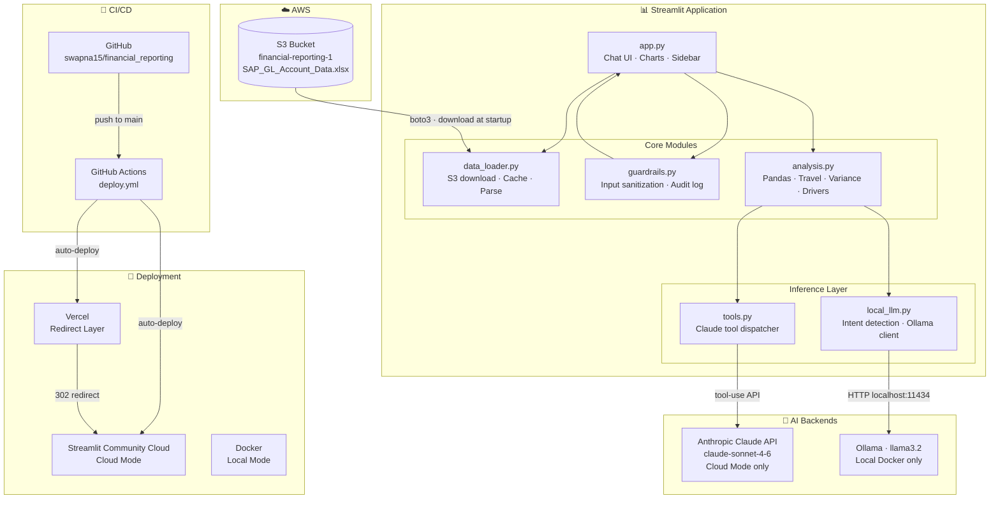
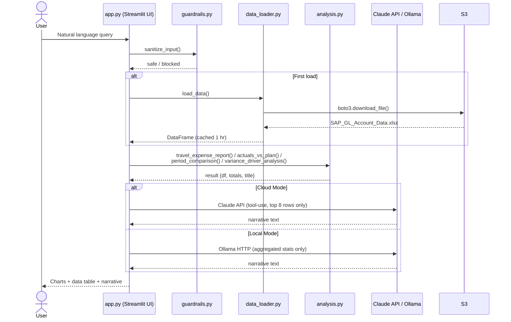

# SAP OpEx Analysis — Architecture

## System Architecture

---

## Request Flow

---

## Component Responsibilities

| Module | Responsibility |
|---|---|
| `app.py` | Streamlit UI, chat loop, chart rendering, mode switching |
| `data_loader.py` | Downloads Excel from S3 at startup, parses & caches DataFrame |
| `analysis.py` | Pure-pandas analysis: travel reports, variance, period comparison, driver analysis |
| `tools.py` | Claude API client, tool dispatcher, serialises results for API payload |
| `local_llm.py` | Regex intent detection, Ollama narrative generation |
| `guardrails.py` | Prompt injection defence, scope enforcement, audit logging |

## Deployment Topology

| Component | Platform | Purpose |
|---|---|---|
| Streamlit App | Streamlit Community Cloud | Hosts the UI (Cloud Mode) |
| Redirect | Vercel | Routes custom domain → SCC |
| Local Dev | Docker + Ollama | Full local mode, no API costs |
| Data | AWS S3 (`financial-reporting-1`) | Single source of truth for Excel data |
| CI/CD | GitHub Actions | Auto-deploys SCC + Vercel on push to `main` |
